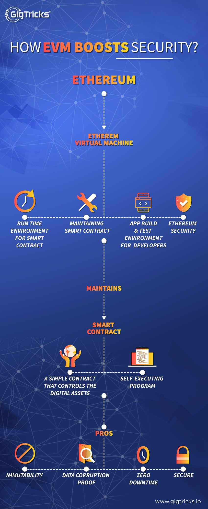
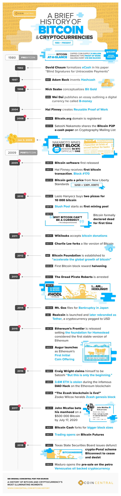

# Information about Ethereum

## Benefits
### What **benefits** does the Ethereum Virtual Machine provide?
- open source
- secure
- corruption-proof
- zero downtime
- decentralized

### From Source
The benefits of Ethereum not only as a blockchain-based platform itself but also compared to other blockchain-based platforms includes:
- **Immutability** - A third party cannot make any changes to data.
- **Corruption/Tamper Proof** - Censorship is unfeasible with the PoW consensus of the vast and decentralized network agreeing on its global state.
- **Security** - The combination of the PoW consensus, cryptographic techniques used in the transaction model, and lack of a central point of failure protects the network against hacking and manipulation.
- **No Downtime** - Applications, smart contracts, organizations, etc all running on the Ethereum blockchain are always running and cannot be turned off.

## Principles
### What **principles** does the Ethereum Virtual Machine uphold?
- immutability
- "the world computer requires a consensus"
- requires *gas*
	- needs *gas* to transfer

### From Source
The design behind Ethereum, based on the white paper, is intended to follow the principles of:
- **Simplicity** - The protocol should be as efficient as possible, even at the cost of data storage or time inefficiencies.
- **Universality** - An internal Turing-complete scripting is provided language that a developer can use to program any smart contract or transaction type.
- **Modularity** - Ethereum protocol should be designed to be as modular and separable as possible.
- **Agility** - The protocol is not set in stone and any opportunities to improve the protocol architecture or the EVM in scalability or security will be exploited.
- **Non-Discrimination**/Non-Censorship - The protocol should not attempt to actively restrict or prevent specific categories of usage.

# Further Information
*Cibil* Attack
