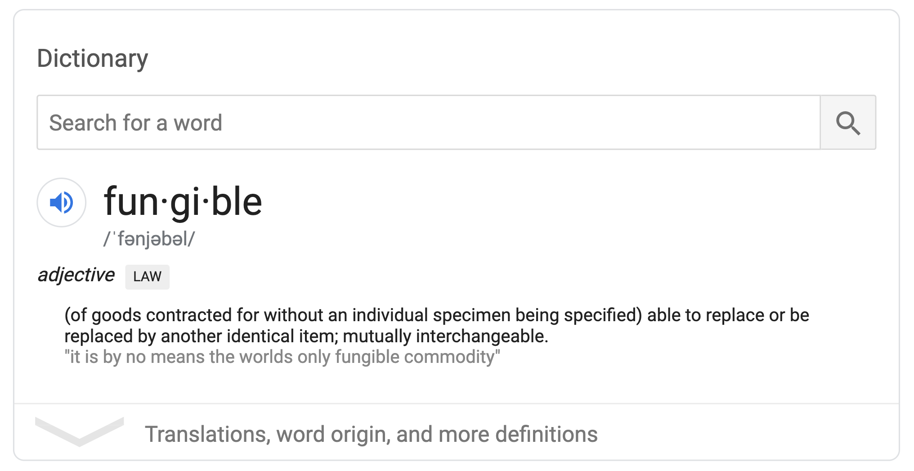
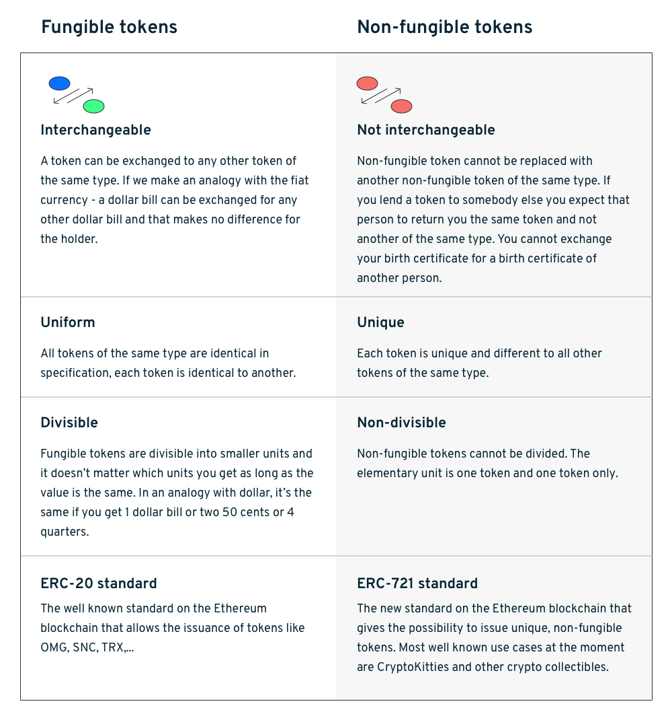

# In Class Activity

_The **Halvening**_

**E**thereum **R**equest for **C**omment. It is a technical standard.

## Coins
### What is a **coin**?
- Fungible
- Divisable
- Acceptable
- Portable
- Durable
- Limited Supply
- Not Unique
- Possesses their own independant blockchain.
- Must be tied to a public open blockchain.
- May be sent and recieved.

### What does **fungible** mean?

### Which ERC defines **fungible tokens**?
> #### `ERC-20`: All tokens are identical.

### Find the URL for the above standard.
> #### https://eips.ethereum.org/EIPS/eip-20

### *How many* tokens use this ERC?
> #### `190,054` tokens

### Provide **>= 3 examples** of these tokens IRL
1. Maker Coin
	- Constantly holds value at 1 USD.
1.
1.

## Tokens
### What is a *token*?
asdf

### What does *non-fungible* mean?
asdf

### Which ERC defines a NFT?
> #### `ERC-721`: All tokens are identical.

### Find the URL for the above standard.
> #### http://erc721.org/

### *How many* tokens use this ERC?
> `???` tokens

### Provide >= 3 examples these token IRL.
1. Crypto Assault Game
	- Buy & Destroy enemies with token units...
1.
1.

# RareBits
Each group should **answer the following questions** based on their assigned marketplace:

## What does this marketplace enable?
It's like amazon for ERC-721 backed random stuff.

## How do you deploy your own dApp to this marketplace?
There is a submit dapp button at the top.
You need a smart contract to submit on the form.

## What features does your marketplace have?
- Rankings
- Searchable Content
- Mixed Content

## Find the **two most interesting tokens** sold on this marketplace.
- Neopet Card Game
- Colorful low-poly horses with odd names
- Some very strange art

## How can you access this marketplace?
- Do you need to install additional software?
No.

- How do you purchase something from this marketplace?
You need ETH & an account.
